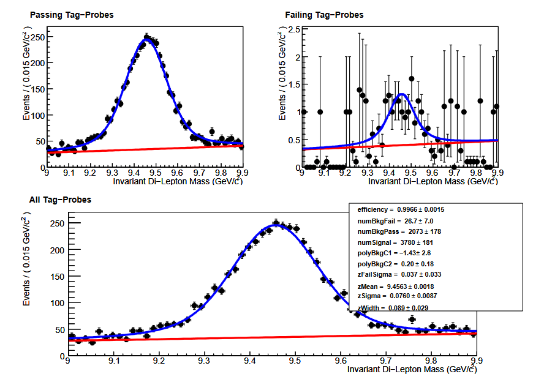

Essentially all CMS analyses rely on simulation. Whether to simulate a new physics signal or Standard Model processes, it is imperative that simulation
reliably reproduces data. Each algorithm that is designed to select events or physics objects must be applied to both data and simulation, so there is always
a risk of performance differing between the two. This is quantified by measuring the **efficiency** for certain objects to be selected by the algorithm.
Differences in efficiency between data and simulation are corrected using **scale factors**.

CMS Analysts regularly evaluate the following algorithms for differences in efficiency between data and simulation:
 * Trigger selection
 * Object reconstruction (typical for electrons and photons)
 * Object identification criteria (typical for all leptons and photons)
 * Object isolation criteria (typical for all leptons and photons)
 * Jet identification algorithms (b tagging, heavy particle tagging, quark-vs-gluon, etc)
 * Custom analysis algorithms

> ## What is efficiency?
> Efficiency typically means (number of objects of type X passing algorithm Y) / (number of objects of type X)
{: .callout}

## Measuring efficiency in data

Measuring an algorithm's efficiency is most complicated in data, because we want to study only "objects of type X". This might mean "electrons", "muons", "b quark jets", etc, and we have learned how it is difficult to precisely identify these objects in data. But we can bring in physics knowledge to help construct collections of certain particles. The common method of measuring lepton-related efficiencies in data is called [**tag and probe**](https://twiki.cern.ch/twiki/bin/view/CMSPublic/TagAndProbe).

In CMS, tag and probe methods typically use Z boson or J/psi meson resonances that decay into 2 same-flavor leptons. One lepton serves as the "tag" and the other is the "probe". An event selected for tag and probe has 2 main characteristics:
 * tag lepton passes various "tight" quality requirements for trigger filters, identification, and isolation
 * dilepton mass from the tag and probe leptons lies within a narrow J/psi or Z mass winder

In events with these characteristics, we can be reasonably sure based on physics that the "probe" lepton is a "real" lepton, and in fact we can do even better by actually fitting the J/psi or Z mass peak to determine the number of events in our calculation. The probe lepton's properties can then be used to determine the efficiency for essentially any lepton-related algorithm! For example, efficiency for the tight identification working point would be (number of tight probes in the Z peak / total number of probes in the Z peak).

The figure below shows an example of tag and probe using the Upsilon resonance to measure the global muon identification efficiency for muons with momentum between 6 and 20 GeV. Obviously the efficiency is quite high (as expected) since post probes pass the identification criteria. Tag and probe is the standard technique in CMS for measuring electron and muon efficiencies for all algorithms, typically scanning over various momentum and pseudorapidity ranges.

## Measuring efficiency in simulation

In simulation, the tag and probe process can certainly be repeated by selecting events using the same criteria as for data. In order to correct the efficiency in simulation to match the efficiency in data it is best if they are computing using the same technique. 

For some algorithms, such as b quark jet identification, efficiency for a specific simulated smaple can be measured directly using the truth information stored in the simulation. For b quark tagging, the relevant efficiencies are defined as:
 * b efficiency = [number of "real b jets" (jets spatially matched to generator-level b hadrons) tagged as b jets] / [number of real b jets]
 * c efficiency = [number of "real c jets" (jets spatially matched to generator-level c hadrons) tagged as c jets] / [number of real c jets]
 * light/gluon efficiency (often called "mistag rate") = [number of "real light/gluon jets" (jets spatially matched to generator-level light hadrons) tagged as light/gluon jets] / [number of real light/gluon jets]

These values are typically computed as functions of the momentum or pseudorapidity of the jet and are computed by analyzers for simulated samples with kinematics relevant to their analysis. In POET, a [BTagging module](https://github.com/cms-legacydata-analyses/PhysObjectExtractorTool/tree/master/BTagging) has been provided for calculating efficiencies. 

As an example, efficiencies for the CSV Medium working point in the top quark pair sample have been computed and stored in lookup function in `PatJetAnalyzer.cc`. The CSV algorithm has a b-quark efficiency of ~60% and a light quark mistag rate of ~1%, as advertised. 
~~~
double PatJetAnalyzer::getBtagEfficiency(double pt){
  if(pt < 25) return 0.263407;
  else if(pt < 50) return 0.548796;
  else if(pt < 75) return 0.656801;
  ...etc...
  else if(pt < 400) return 0.625296;
  else return 0.394916;
}

double PatJetAnalyzer::getLFtagEfficiency(double pt){
  if(pt < 25) return 0.002394;
  else if(pt < 50) return 0.012683;
  else if(pt < 75) return 0.011459;
  ...etc...
  else if(pt < 400) return 0.014760;
  else return 0.011628;
}
~~~
{: .language-cpp}

## Scale factors

Any differences between efficiencies in data and simulation should be corrected using **scale factors**.

> ## What is a scale factor?
> In a given bin of object momentum and pseudorapidity (or other criteria), the scale factor = (efficiency in data) / (efficiency in simulation).
{: .callout}

Scale factors inherit the binning of the efficiency measurements, however they are made. For example, the figure below shows the efficiencies in data and simulation
for tight muon identification in 2010 data. The corresponding scale factors would be the ratio of the black point to the red point in each bin.

Scale factors are typically applied to simulation using **event weights**. If a certain scale factor is 1.05, the number of simulated events in that bin should be
increased by 5% by giving each individual event a weight of 1.05 instead of 1.

## Uncertainties

All scale factors carry uncertainties. Statistical uncertainties arise from the limited number of events available to make the efficiency measurements. Systematic
uncertaities can come from a variety of sources, such as:
 * Alternate simulated samples
 * Alternate efficiency measurement methods
 * Alternate fitting functions when fits are used

CMS analysts apply uncertainties in two ways, either as **rate uncertainties** or **shape uncertainties**. Rate uncertainties are best for scale factors with very
small uncertainties, or uncertainties that are essentially stable for the majority of events in an analysis. For lepton scale factors it is common to assign an uncertainty
of 1-2% in all bins. For b tagging and many other scale factors is it more effective to use a shape uncertainty: the scale factor values are shifted up or down according
to their uncertainties and 3 versions of the analysis histograms are constructed. An example is shown below for b quark tagging: the uncertainty on the scale factor can be
mapped to an uncertainty on the b quark jet momentum using the shape uncertainty concept.

Later in the hands-on exercise and challenge we will practice applying scale factors and working with shape uncertainties.



