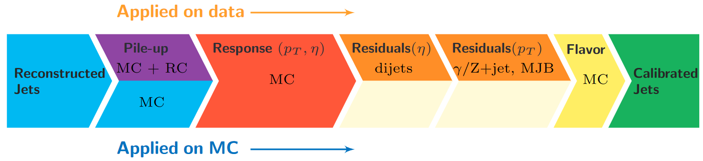

Unsurprisingly, the CMS detector does not measure jet energies perfectly, nor
do simulation and data agree perfectly! The measured energy of jet must be
corrected so that it can be related to the true energy of its parent particle.
These corrections account for several effects and are factorized so that each
effect can be studied independently. 

## Correction levels

Particles from additional interactions in nearby bunch crossings of the LHC contribute energy in the calorimeters that must somehow be distinguished from the
energy deposits of the main interaction. Extra energy in a jet's cone can make its measured momentum larger than the momentum of the parent particle.
The first layer ("L1") of jet energy corrections accounts for pileup by subtracting the average transverse momentum contribution of the pileup interactions to
the jet's cone area. This average pileup contribution varies by pseudorapidity and, of course, by the number of interactions in the event. 

The second and third layers of corrections ("L2L3") correct the measured momentum to the true momentum as functions of momentum and pseudorapidity, bringing
the reconstructed jet in line with the generated jet. These corrections are derived using momentum balancing and missing energy techniques in dijet and Z
boson events. One well-measured object (ex: a jet near the center of the detector, a Z boson reconstructed from leptons) is balanced against a jet for which
corrections are derived.

All of these corrections are applied to both data and simulation. Data events are then given "residual" corrections to bring data into line with the corrected
simulation. A final set of flavor-based corrections are used in certain analyses that are especially sensitive to flavor effects. All of the corrections are
described in [this paper](https://arxiv.org/pdf/1107.4277.pdf). The figure below shows the result of the L1+L2+L3 corrections on the jet response.

## JEC while producing pat::Jets

Another popular object format in CMS is the "Physics Analysis Toolkit" format, called PAT. The jet energy corrections and Type-1 MET corrections can be
applied to RECO jets while making PAT jets. To do this we will load the global tag and databases directly in the configuration file and use the 'addJetCollection'
process to create a collection of pat::jets. Look at `simulation_patjets_cfg.py`:

FIXME TO POET AND FOR COMPLETENESS

~~~
# Set up the new jet collection                                                                             
process.ak5PFJets.doAreaFastjet = True
addPfMET(process, 'PF')

addJetCollection(process,cms.InputTag('ak5PFJets'),
                 'AK5', 'PFCorr',
                 doJTA        = True,
                 doBTagging   = True,
                 jetCorrLabel = ('AK5PF', cms.vstring(['L1FastJet','L2Relative','L3Absolute']))
                 doType1MET   = True,
                 doL1Cleaning = True,
                 doL1Counters = False,
                 doJetID      = True,
                 jetIdLabel   = "ak5",
                 )
~~~
{: .language-python}

In `AOD2NanoAOD.cc` we can look at the sections marked `if(doPat)` to see the difference in usage. In general, pat::jets are more
complex to create in the configuration file, but simpler to use because of their additional functions. In particular, accessing the
jet's flavor directly makes calculation of b-tagging efficiencies and scale factors simpler.

~~~
  if(doPat){

    Handle<PFMETCollection> metT1;
    iEvent.getByLabel(InputTag("pfType1CorrectedMet"), metT1);
    value_met_type1_pt = metT1->begin()->pt();

    Handle<std::vector<pat::Jet> > patjets;
    iEvent.getByLabel(InputTag("selectedPatJetsAK5PFCorr"), patjets);

    value_patjet_n = 0;
    for (auto it = patjets->begin(); it != patjets->end(); it++) {
      if (it->pt() > jet_min_pt) {

        // Corrected values are now the default                                                             
        value_patjet_pt[value_patjet_n] = it->pt();
        value_patjet_eta[value_patjet_n] = it->eta();
        value_patjet_mass[value_patjet_n] = it->mass();

        // but uncorrected values can be accessed. JetID should be computed from the uncorrected jet        
        pat::Jet uncorrJet = it->correctedJet(0);
        value_uncorr_patjet_pt[value_patjet_n] = uncorrJet.pt();
        value_uncorr_patjet_eta[value_patjet_n] = uncorrJet.eta();
        value_uncorr_patjet_mass[value_patjet_n] = uncorrJet.mass();

        // b-tagging is built in. Can access the truth flavor needed for b-tag effs & scale factor application!                                                                                                        
        value_patjet_hflav[value_patjet_n] = it->hadronFlavour();
        value_patjet_btag[value_patjet_n] = it->bDiscriminator( "pfCombinedInclusiveSecondaryVertexV2BJetTags");

        value_patjet_n++;
      }
    }
  }
~~~
{: .language-cpp}

## Jet Energy Resolution corrections

FIXME -- NEW STUFF IN 2021

## Uncertainties FIXME ADD JER

You will have noticed that nested among the jet energy correction code snippets give above were commands related to the uncertainty in this correction.
The uncertainty is also read from a text file in this example, and is used to increase or decrease the correction to the jet momentum. 

~~~
// Object definition
boost::shared_ptr<FactorizedJetCorrector> jec_;

// In the constructor the JetCorrectionUncertainty is set up
AOD2NanoAOD::AOD2NanoAOD(const edm::ParameterSet &iConfig){

  jecUncName_ = iConfig.getParameter<edm::FileInPath>("jecUncName").fullPath();      // JEC uncertainties                               
  jecUnc_ = boost::shared_ptr<JetCorrectionUncertainty>( new JetCorrectionUncertainty(jecUncName_) );

  // ....function continues
}

// In the analyze function the uncertainty is evaluated
for (auto it = jets->begin(); it != jets->end(); it++) {
  if (it->pt() > jet_min_pt) {

    double corr = jec_->getCorrection();

    jecUnc_->setJetEta( uncorrJet.eta() );
    jecUnc_->setJetPt( corr * uncorrJet.pt() );
    double corrUp = corr * (1 + fabs(jecUnc_->getUncertainty(1)));
    double corrDown = corr * ( 1 - fabs(jecUnc_->getUncertainty(-1)) );

    value_corr_jet_ptUp[value_jet_n] = corrUp * uncorrJet.pt();
    value_corr_jet_ptDown[value_jet_n] = corrDown * uncorrJet.pt();
   
  }
}
~~~
{: .language-cpp}

The uncertainties have several sources, shown in the figure below. The L1 (pileup) uncertainty dominates at low momentum,
while the L3 (absolute scale) uncertainty takes over for higher momentum jets. All corrections are quite precise for
jets located near the center of the CMS barrel region, and the precision drops as pseudorapidity increases and different
subdetectors lose coverage. 



