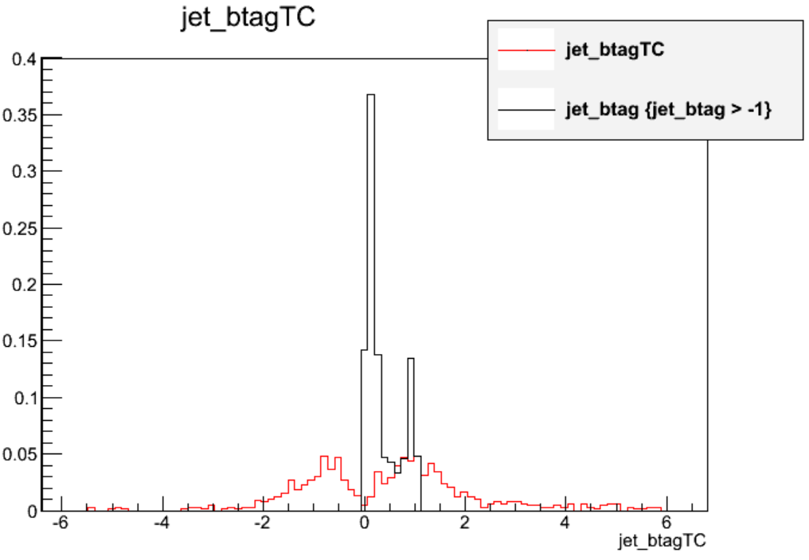

Choose your exercise! Complete exercise #1 on the muon corrections, and then choose one of the options for exercise #2 on b-tagging.

>## Exercise 1: results of the muon correction
>Exercise text goes here!
>
>> ## Solution
>> Solution goes here
>{: .solution}
{: .challenge}

>## Exercise 2 option A: alternate b taggers
>
>The statements printed from `addJetCollection` when running `poet_cfg.py` shows the options for 
>strings that can be used in the `bdiscriminator()` function:
>~~~
>The bdiscriminators below will be written to the jet collection in the PATtuple (default is all, see PatAlgos/PhysicsTools/python/tools/jetTools.py)
>jetBProbabilityBJetTags
>jetProbabilityBJetTags
>trackCountingHighPurBJetTags
>trackCountingHighEffBJetTags
>simpleSecondaryVertexHighEffBJetTags
>simpleSecondaryVertexHighPurBJetTags
>combinedSecondaryVertexBJetTags
>~~~
>{: .output}
>
>Add 1-2 new branches for alternate taggers and compare those discriminants to CSV.
>
>After editing `PatJetAnalyzer.cc`,
>~~~
>$ scram b
>$ cmsRun python/poet_cfg.py False True
>$ root -l myoutput.root
>[0] TBrowser b
>~~~
>{: .source}
>
>>## Solution
>>Let's add the high purity track counting tagger, which was the most common tagger in 2011.
>>After adding a new array declaration and branch in the top sections of `PatJetAnalyzer.cc`, we can call `bDiscriminator()`
>>for these alternate tagger:
>>~~~
>>// Declarations
>>std::vector<double> jet_btag;
>>std::vector<double> jet_btagTC;
>>
>>// Branches
>>mtree->Branch("jet_btag",&jet_btag);
>>mtree->Branch("jet_btagTC",&jet_btagTC);
>>
>>// inside the jet loop
>>  jet_btag.push_back(itjet->bDiscriminator("combinedSecondaryVertexBJetTags"));
>>  jet_btag.push_back(itjet->bDiscriminator("trackCountingHighPurBJetTags"));
>>~~~
>>{: .language-cpp}
>>
>>The distributions in ttbar events (excluding events with values of -9 where the tagger wasn't evaluated) look like this:
>>
>{: .solution}
{: .challenge}

>## Exercise 2 option B: count medium CSV b tags
>
>Calculate the number of jets per event that are b tagged according to the medium working point of the CSV algorithm.
>Store a branch called `jet_nCSVM` and draw it 3 times, applying the scale factor weights and demonstrating the uncertainty. 
>
>After editing `PatJetAnalyzer.cc`,
>~~~
>$ scram b
>$ cmsRun python/poet_cfg.py False True
>$ root -l myoutput.root
>[0] _file0->cd("myjets")
>[1] Events->Draw("jet_nCSVM","(btagWeight)")
>[2] Events->Draw("jet_nCSVM","(btagWeightUp)","p hist same")
>[3] Events->Draw("jet_nCSVM","(btagWeightDown)","p hist same")
>~~~
>{: .source}
>
>>## Solution
>>We count the number of "Medium CSV" b-tagged jets by summing up the number of jets with discriminant values greater than 0.679.
>>After adding a variable declaration and branch we can sum up the counter:
>>
>>~~~
>>int jet_nCSVM = 0;
>>for (std::vector<pat::Jet>::const_iterator itjet=myjets->begin(); itjet!=myjets->end(); ++itjet){
>>
>>  // ... JEC uncert, JER, storing variables...
>>
>>  jet_btag.push_back(itjet->bDiscriminator("combinedSecondaryVertexBJetTags"));
>>  if (itjet->bDiscriminator("combinedSecondaryVertexBJetTags") > 0.679) jet_nCSVM++;
>>}
>>~~~
>>{: .language-cpp}
>>
>>Applying the scale factor weight shifts the mean of the distribution <SOMEHOW>. The uncertainty wraps around the central distribution
>>with a magnitude of approximately X% in this sample.
>>
>{: .solution}
{: .challenge}



