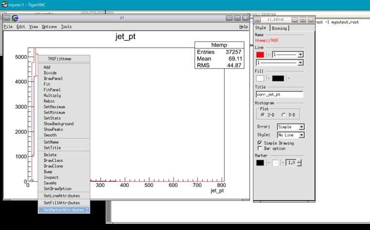

Let's dig into the JEC and JER corrections and uncertainties by studying their effect on jet momentum histograms.

> ## Run POET
>Take some time to run POET using the entire top quark pair test file. In `python/poet_cfg.py` set the
>number of events to process to -1:
>~~~
>#---- Select the maximum number of events to process (if -1, run over all events)
>process.maxEvents = cms.untracked.PSet( input = cms.untracked.int32(-1) )
>~~~
>{: .language-python}
>
>And run POET using `cmsRun python/poet_cfg.py False True`. Great time to read ahead on tomorrow's lessons!
{: .prereq}

Open `myoutput.root` and investigate the range of momentum variation given by the JEC uncertainties by plotting: 
 * Corrected versus uncorrected jet momentum
 * Corrected jet momentum with JEC up and down uncertainties
 * Corrected jet momentum with JER up and down uncertainties

>## Questions:
>Is the difference between the raw and corrected momentum larger or smaller than the uncertainty?
>Which uncertainty dominates?
>
>Repeat these plots with the additional requirement that the jets be "forward" (`abs(jet_eta) > 3.0`)
>How do the magnitudes of the uncertainties compare in this region?
{: .question}

Recall: to draw plots on the ROOT command line use the following syntax:
~~~
$ root -l myoutput.root
[0] _file0->cd("myjets");
[1] Events->Draw("jet_pt"); // draw the branch jet_pt
[2] Events->Draw("jet_pt","abs(jet_eta) > 3.0","same"); // draw jet_pt with a cut on jet_eta, on top of the previous plot
[3] Events->Draw("jet_pt","abs(jet_eta) < 3.0","pe same"); // draw jet_pt again with a different cut using points & error bars
~~~
{: .source}

To use different line colors and styles in a plot, "right-click" on a histograms and use
the "Set Line Attributes" GUI to change the color and style of the lines and markers. Clicking
on a different histogram will automatically change which plot's style the GUI is controlling.

> ## Solutions
> Come back tomorrow to go over these plots!
{: .testimonial}


