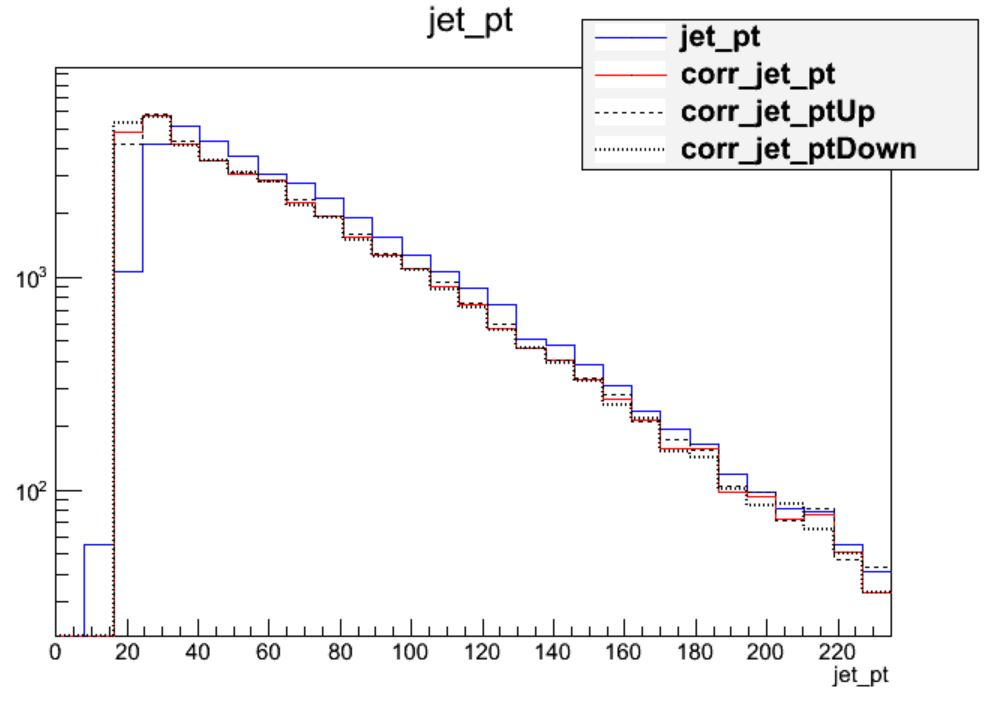
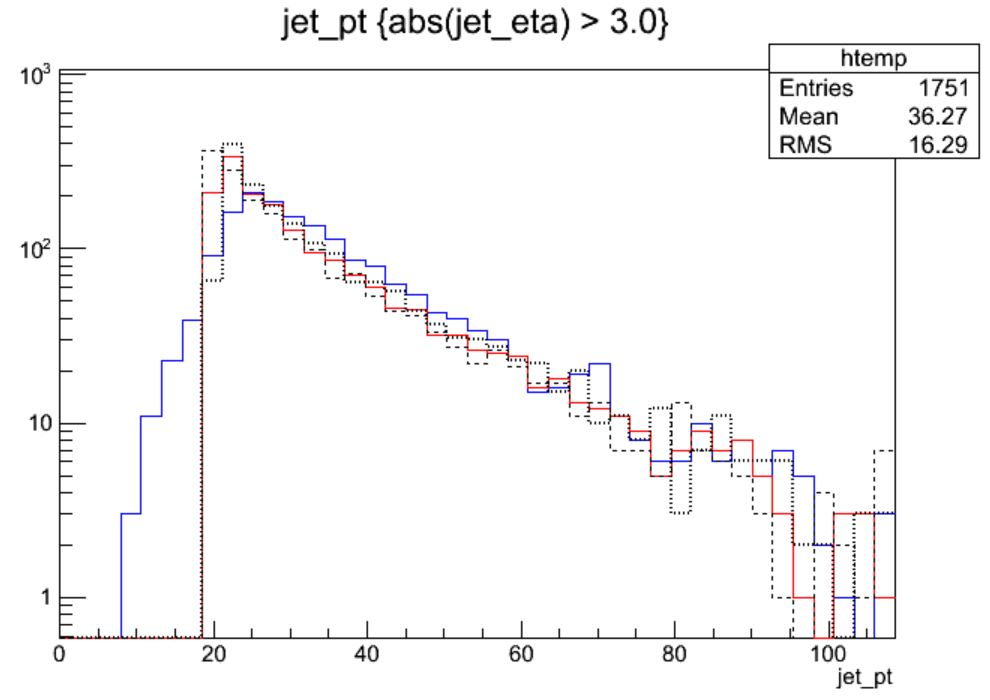

Open `myoutput.root` and investigate the range of momentum variation given by the JEC uncertainties by plotting: 
 * Corrected versus uncorrected jet momentum
 * Corrected jet momentum with JEC up and down uncertainties
 * Corrected jet momentum with JER up and down uncertainties

>## Questions:
>Is the difference between the raw and corrected momentum larger or smaller than the uncertainty?
>Which uncertainty dominates?
>>## Solution
>>The following plotting commands can be used to draw the four histograms needed to answer the first question:
>>~~~
>>$ root -l myoutput.root
>>[1] _file0->cd("myjets");
>>[2] Events->Draw("jet_pt");
>>[3] Events->Draw("corr_jet_pt","","hist same");
>>[4] Events->Draw("corr_jet_ptUp","","hist same");
>>[5] Events->Draw("corr_jet_ptDown","","hist same");
>>~~~
>>{: .source}
>>
>>
>>
>>We can see that the corrections are significant, far larger than the uncertainty itself. The first level of
>>correction, for pileup removal, tends to reduce the momentum of the jet. The JER uncertainty can be drawn using
>>similar commands:
>>
>>
>>
>>This uncertainty is much smaller for the majority of jets! The JER correction is similar to the muon Rochester
>>corrections in that it is most important for analyses requiring higher precision in jet agreement between data and
>>simulation.
>{: .solution}
>
>Repeat these plots with the additional requirement that the jets be "forward" (`abs(jet_eta) > 3.0`)
>How do the magnitudes of the uncertainties compare in this region?
>
>>## Solution
>>This time we need to apply cuts to the jets as we draw:
>>~~~
>>$ root -l myoutput.root
>>[1] _file0->cd("myjets");
>>[2] Events->Draw("jet_pt","abs(jet_eta) > 3.0");
>>[3] Events->Draw("corr_jet_pt","abs(jet_eta) > 3.0","hist same");
>>[4] Events->Draw("corr_jet_ptUp","abs(jet_eta) > 3.0","hist same");
>>[5] Events->Draw("corr_jet_ptDown","abs(jet_eta) > 3.0","hist same");
>>~~~
>>{: .source}
>>
>>
>>
>>
>>In the endcap region the uncertainty on the JER scale factor has become nearly 20%! So this uncertainty
>>gains almost equal footing with JEC. Many CMS analyses restrict themselves to studying jets in the "central"
>>region of the detector, defined loosely by the tracker acceptance region of `abs(eta) < 2.4` precisely to
>>avoid these larger JEC and JER uncertainties.
>{: .solution}
{: .question}



